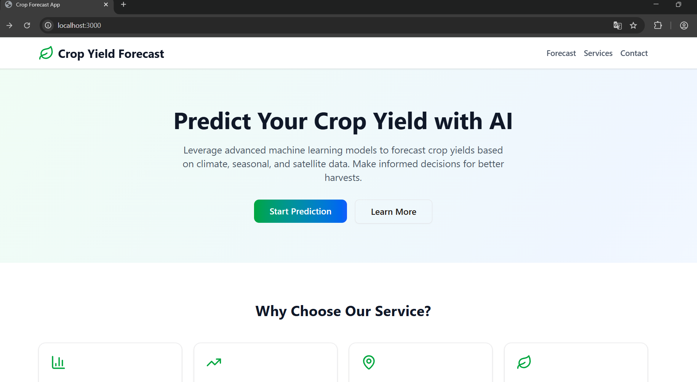
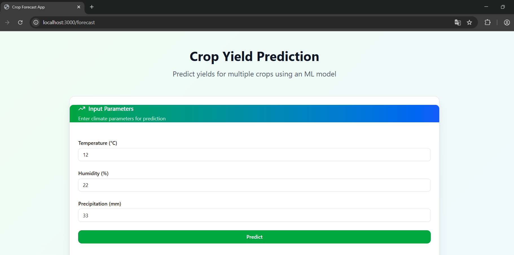
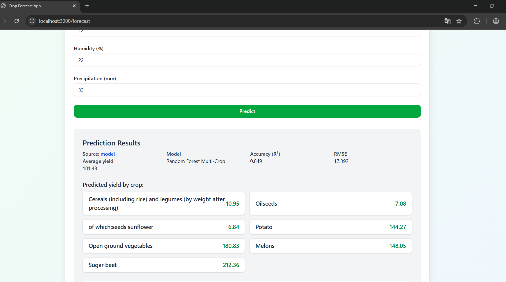
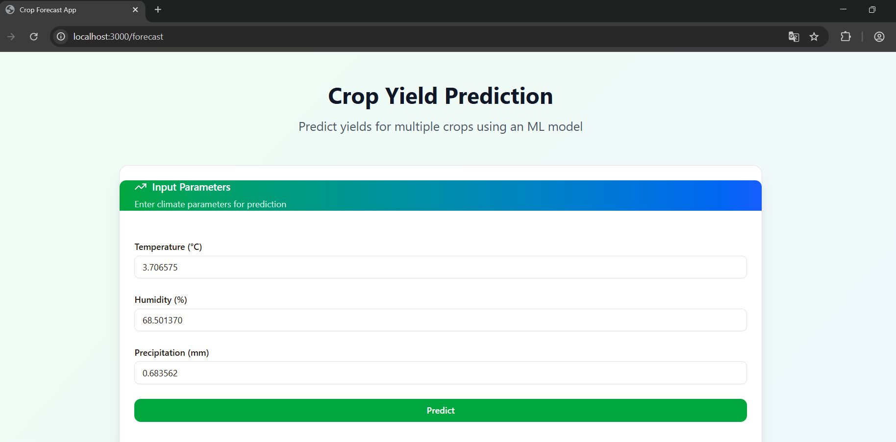
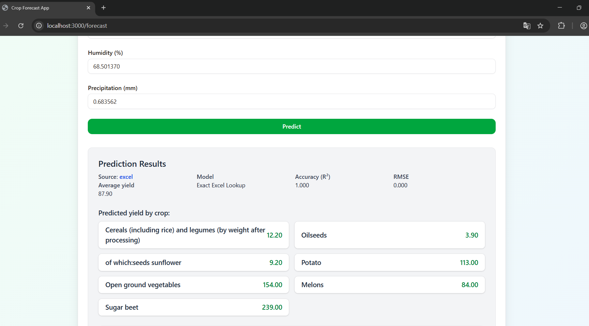
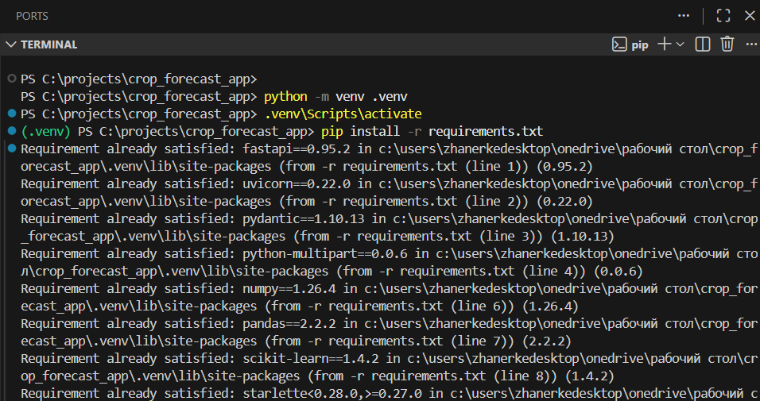
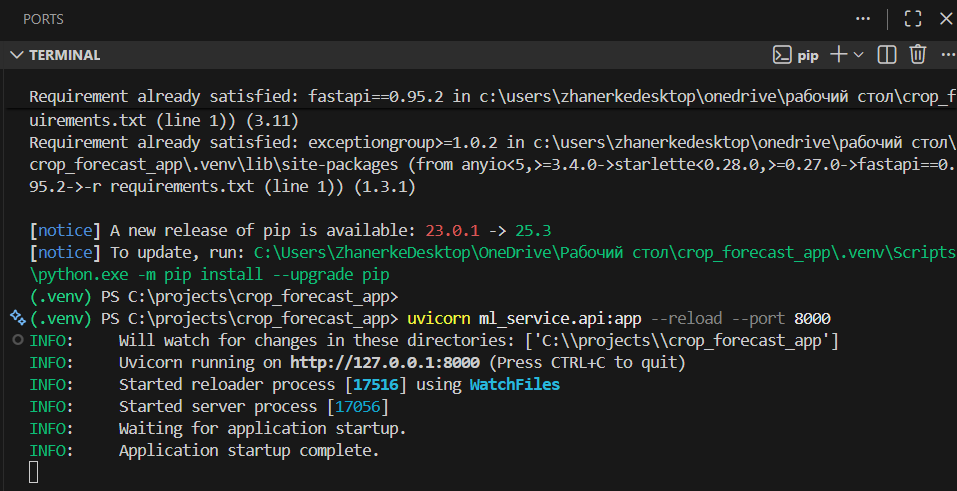
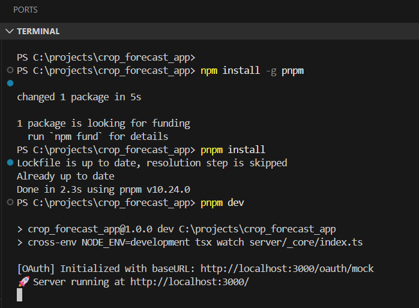
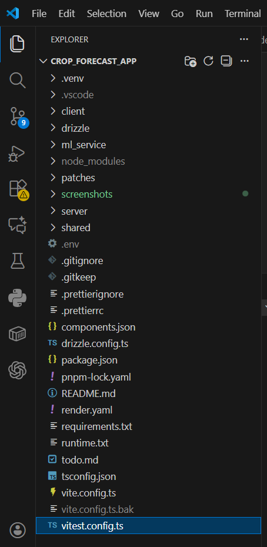

Crop Yield Forecasting System — End-to-End Machine Learning Application \\English version

Machine Learning + Full Web Application 

This project presents a complete machine learning and web-based system for predicting agricultural crop yields using climatic and seasonal parameters. The model is trained on a unique, manually collected dataset provided by field practitioners, offering realistic, domain-specific data unavailable through public platforms such as eGov. Working with authentic field observations enabled handling noise, missing values, and irregular patterns typical of real-world agricultural environments
This project was carried out as part of my academic research, with light methodological guidance from Aigul Mimenbayeva, MSc, School of Artificial Intelligence and Data Science.All implementation, system design, and model development were conducted by me, while the supervisor ensured scientific correctness and supported the work from a research-oriented perspective.  
The system includes the full development pipeline:

data preprocessing and feature engineering

training and evaluation of a Random Forest regression model

model serialization and API deployment with FastAPI

a fully functional React-based frontend for user interaction

A hybrid inference mechanism is implemented:
when exact historical observations exist, the system returns the actual recorded yield; otherwise, a machine learning prediction is generated. This design increases transparency, robustness, and practical applicability for agricultural decision-making.
Overall, the project demonstrates my ability to develop a full-stack analytical system, work with authentic field data, and apply machine learning techniques to a meaningful real-world problem within the domain of precision agriculture.

A complete end-to-end system for predicting agricultural crop yields based on climatic inputs.
The solution includes:

Python ML Service (FastAPI)

Trained RandomForest Model (multi_crop_model.pkl)

Automatic Excel Value Lookup for Exact Historical Matches

Fully Functional Frontend (React + Vite + TypeScript)

Homepage

Data entering

Results

Chart result

Since RandomForest is not able to give the exact output as in the Excel, I added Automatic Excel Value Lookup for Exact Historical Matches

🔧 Tech Stack
Backend — Python (FastAPI)

FastAPI REST API

RandomForest Regressor (multi-output)

Exact-yield lookup table from Excel

Numpy, Pandas, Scikit-Learn

Frontend — React + Vite + TypeScript

Modern component-based UI

Chart.js visualization

API integration with Python service

🛠 Installation Guide
1. Install Python 3.10+

Download from:
https://www.python.org/downloads/

2. Install Node.js v18

Download from:
https://nodejs.org/en/download/prebuilt-installer

3. Start the ML Backend (Python)

Open terminal #1:

python -m venv .venv
.venv\Scripts\activate
pip install -r requirements.txt

uvicorn ml_service.api:app --reload --port 8000

Backend will be available at:

http://127.0.0.1:8000/predict
(not the webpage!)

4️. Start the Web Server (Node.js)

Open terminal #2(do not close the first terminal):

npm install -g pnpm
pnpm install
pnpm dev

Frontend will run at:

http://localhost:3000

⚙️ How the System Works
User Inputs

Temperature

Humidity

Precipitation

ML Backend Logic

Checks for exact matches of climate values in the Excel lookup table

If found → returns the original historical yields

If not found → the RandomForest multi-output model predicts yields for all crops

Returned Data Includes

Predicted yield for each crop

Average yield

R² score (accuracy)

RMSE (error metric)

Frontend

Sends parameters to backend

Displays yield results

Renders comparison chart

Project Structure
crop_forecast_app/
│
├── ml_service/
│   ├── api.py                  # FastAPI backend
│   ├── model.py                # Training script
│   ├── multi_crop_model.pkl    # Trained RandomForest model
│   ├── requirements.txt        # Python dependencies
│   └── Crop_Yield_NK 1.xlsx    # Historical dataset
│
├── server/
│   ├── src/
│   │   ├── pages/
│   │   ├── components/
│   │   └── ...
│   ├── package.json
│   └── tsconfig.json
│
└── README.md

 Key Features

Multi-crop yield prediction

Climate-based lookup + ML fallback

Zero rounding or transformation of original Excel data

Clean, modern React frontend

FastAPI backend with real-time response 

CROP YIELD FORECASTING SYSTEM \\Russion version

Machine Learning + Web Application

Этот проект включает:

Python ML-сервис (FastAPI)

Обученную RandomForest модель (multi_crop_model.pkl)

Автоматический поиск точных значений урожайности (lookup таблица из Excel)

Полный frontend (React + Vite + TypeScript)

Установить Python 3.10+

https://www.python.org/downloads/

2 Установить Node.js v18

https://nodejs.org/en/download/prebuilt-installer

3 Backend (Python ML)

Выполнить:

python -m venv .venv
.venv\Scripts\activate
pip install -r requirements.txt
uvicorn ml_service.api:app --reload --port 8000

Backend работает:
 http://127.0.0.1:8000/predict
(не веб-страница!)
4️ Server (Node.js)

Открыть второй терминал, не закрывая первый:

npm install -g pnpm
pnpm install
pnpm dev

Сайт работает:
 http://localhost:3000

Как система работает

Пользователь вводит:

Температуру

Влажность

Осадки

Backend ML-модель:

Находит точное совпадение (если есть) в Excel-таблице

Или использует RandomForest для предсказания

Возвращает:

Урожайность всех культур

Средний урожай

R² accuracy

RMSE ошибки

Frontend отображает результат и график.

Структура проекта
crop_forecast_app/
│
├── ml_service/
│   ├── api.py              ← FastAPI backend
│   ├── model.py            ← Обучение модели
│   ├── multi_crop_model.pkl← Обученная модель
│   ├── requirements.txt     ← Python зависимости
│   └── Crop_Yield_NK 1.xlsx ← Источник данных
│
├── client/ (или src/)
│   ├── pages/
│   ├── components/
│   ├── ...
│
├── package.json
└── README.md
